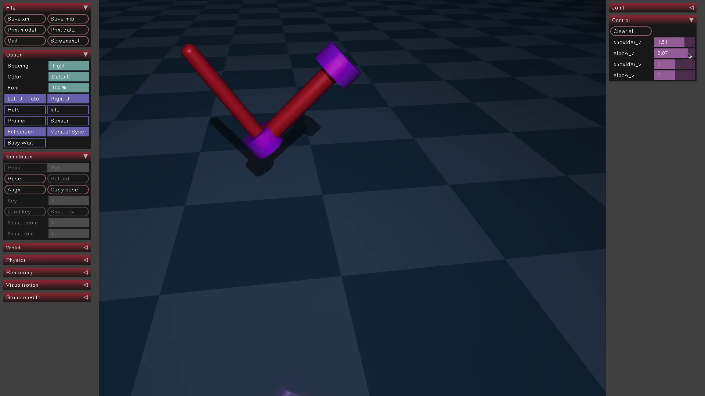
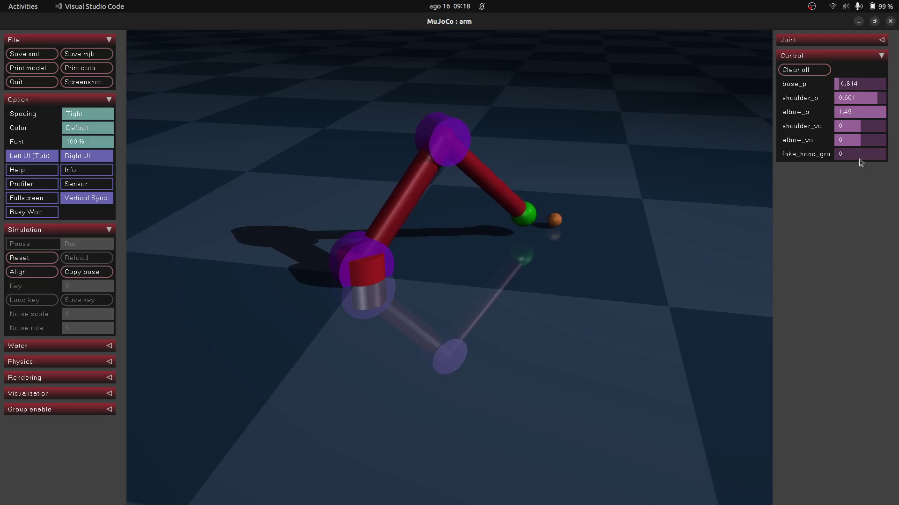

# Robotic Manipulation
🤖
## Dependencies
- Ubuntu 22.04 (tested)
- Python 3.10 (tested)

## Getting Started

### Install package dependencies
In order to install the dependencies we will use the Virtual Environment (venv) from Python 3. The ```do_env.sh``` will create the virtual environment if you run the following command:

```bash
./do_env.sh
```

### Activate virtual environment (venv)
To activate the virtual environment (venv) we can use the following command:

```bash
source venv/bin/activate
```

You should see something like in your terminal:
```bash
(venv) user@computer:~/path/to/folder/robotic-manipulation$
```
### Run Double Inverted Pendulum (mujoco_test.py)
To run the mujoco_test.py (which have a simple 2 degrees of freedom arm model, like a double inverted pendulum) just use the command:

```bash
python mujoco_test.py
```
You should expect a MuJoCo window to open and looking like this.

### Run Ball Catcher Example (mujoco_ball_catcher.py)
For a more complex modeling and manipulation tasks, to run the mujoco_ball_catcher.py (which have a simple 3 degrees of freedom arm model) just use the command:

```bash
python mujoco_ball_catcher.py
```
NOTE: This example starts the first task and follows through automatically:

- Task 1 - Go to Ball
- Task 2 - Grab Ball
- Task 3 - Moving ball to destination
- Task 4 - Ungrab Ball

You should expect a MuJoCo window to open and looking like this.



